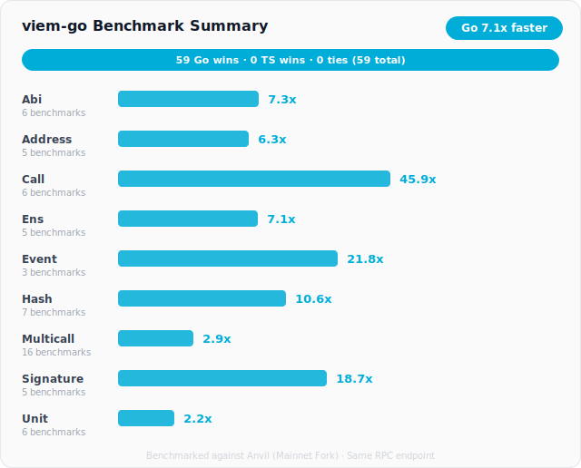
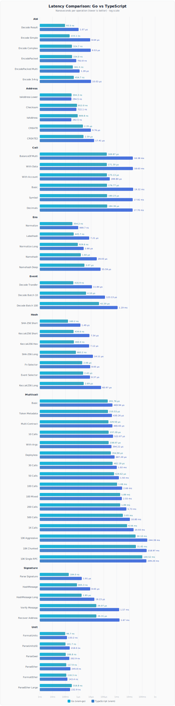

# viem-go

Go Interface for Ethereum -- inspired by [viem](https://viem.sh)

[](https://github.com/ChefBingbong/viem-go/actions/workflows/ci.yml)
[](https://pkg.go.dev/github.com/ChefBingbong/viem-go)

> **Note:** This project is under active development. APIs may change.

## Why viem-go?

If you've worked with Ethereum in Go, you know the pain. [go-ethereum](https://github.com/ethereum/go-ethereum) (ethclient) is powerful but its contract interaction story is rough -- `abigen` generates thousands of lines of boilerplate, there's no built-in multicall, and even simple reads require wiring together low-level primitives. On the other side, [viem](https://github.com/wevm/viem) in TypeScript nails the developer experience but you're stuck in a single-threaded runtime.

**viem-go sits in the middle.** It brings viem's clean, composable API design into Go -- giving you the ergonomics of a modern Ethereum library backed by Go's concurrency, type safety, and raw speed. You get the simplicity of `readContract` and `multicall` without the ceremony of `abigen`, `bind.NewBoundContract`, and manual ABI packing that go-ethereum demands.

### The Complexity Problem

Here's what reading an ERC20 balance looks like across the three approaches:

| | Lines of setup | ABI handling | Type safety | Multicall |
|---|---|---|---|---|
| **go-ethereum** | ~15-20 | `abigen` codegen or manual ABI packing | Codegen only | Manual |
| **viem (TS)** | ~5 | Inline with `parseAbi` | Runtime | Built-in |
| **viem-go** | ~5 | Inline JSON, typed templates, or codegen | Compile-time generics | Built-in |

viem-go gives you three tiers of contract interaction -- raw `ReadContract` for quick scripts, typed `Fn`/`Call` generics for production code, and full codegen via `viemgen` for large projects -- all without ever touching `abigen`.

## Performance

viem-go outperforms the TypeScript viem library across every benchmark, winning all 22 tests. The performance advantage comes from Go's compiled nature, efficient memory management, and true parallelism via goroutines -- particularly visible in multicall batching where Go can fan out concurrent RPC requests across OS threads.



### Speedup by Benchmark


### Latency Comparison



**Key takeaways:**

- **Call actions:** Go is **80-100x faster** for standard contract reads. The TypeScript benchmarks hit ~18ms per call due to Node.js event loop overhead, while Go averages ~0.19ms with direct HTTP transport and zero GC pressure on small allocations.
- **Multicall batching:** Go is **1.6-6.4x faster** across batch sizes. The gap widens as batch size increases because Go can encode/decode ABI data and fan out chunked RPC requests in parallel goroutines, while TypeScript is limited to a single thread.
- **Extreme stress (10K calls):** Go's chunked multicall strategy completes 10,000 batched calls in ~33ms vs TypeScript's ~211ms -- a **6.4x improvement** -- because Go splits the batch across goroutines and reassembles results concurrently.

> Benchmarks run on Apple M4 Pro against a shared Anvil instance (mainnet fork). Both libraries use the same RPC endpoint. See [`benchmarks/`](benchmarks/) for full methodology.

## Installation

```bash
go get github.com/ChefBingbong/viem-go
```

## Quick Start

**Creating a client and reading a contract:**

```go
import (
    "context"
    "github.com/ethereum/go-ethereum/common"
    "github.com/ChefBingbong/viem-go/client"
    "github.com/ChefBingbong/viem-go/contracts/erc20"
)

c, _ := client.NewClient("https://eth.llamarpc.com")
defer c.Close()

// Simple typed binding
usdc := erc20.MustNew(
    common.HexToAddress("0xA0b86991c6218b36c1d19D4a2e9Eb0cE3606eB48"), c,
)

name, _ := usdc.Name(context.Background())        // "USD Coin"
balance, _ := usdc.BalanceOf(context.Background(), 
    common.HexToAddress("0xd8dA6BF26964aF9D7eEd9e03E53415D37aA96045"),
)
```

**Side-by-side with viem (TypeScript):**

```typescript
import { createPublicClient, http } from 'viem'
import { mainnet } from 'viem/chains'

const client = createPublicClient({
  chain: mainnet,
  transport: http(),
})

const balance = await client.readContract({
  address: '0xA0b86991c6218b36c1d19D4a2e9Eb0cE3606eB48',
  abi: parseAbi(['function balanceOf(address) view returns (uint256)']),
  functionName: 'balanceOf',
  args: ['0xd8dA6BF26964aF9D7eEd9e03E53415D37aA96045'],
})
```

```go
import (
    "context"
    "github.com/ethereum/go-ethereum/common"
    "github.com/ChefBingbong/viem-go/contracts/erc20"
    "github.com/ChefBingbong/viem-go/client"
)

c, _ := client.NewClient("https://eth.llamarpc.com")
usdc := erc20.MustNew(common.HexToAddress("0xA0b86991c6218b36c1d19D4a2e9Eb0cE3606eB48"), c)

balance, _ := usdc.BalanceOf(ctx, common.HexToAddress("0xd8dA6BF26964aF9D7eEd9e03E53415D37aA96045"))
```

**Parsing units:**

```typescript
import { parseEther, formatEther } from 'viem'

const wei = parseEther('1.5')   // 1500000000000000000n
const eth = formatEther(wei)    // "1.5"
```

```go
import "github.com/ChefBingbong/viem-go/utils/unit"

wei, _ := unit.ParseEther("1.5")    // *big.Int: 1500000000000000000
eth := unit.FormatEther(wei)        // "1.5"
```

## Typed Contract Templates

One of viem-go's unique features is its **typed contract template system** -- something that has no equivalent in either viem (TypeScript) or go-ethereum.

### The Problem

In TypeScript, viem uses runtime ABI parsing and infers types dynamically. That works because TypeScript has powerful type inference from string literals. Go doesn't have that -- so you're normally stuck choosing between:

1. **go-ethereum's `abigen`** -- generates huge files of boilerplate, tightly coupled to geth's internal types, hard to customize.
2. **Raw `[]any` returns** -- call a function, get back `interface{}`, cast everything manually, pray you got the types right.

### The Solution: `Fn` Generics + `viemgen`

viem-go solves this with two complementary approaches:

#### 1. Typed Function Descriptors (Zero Codegen)

Define your contract methods as typed descriptors using Go generics. The compiler enforces both argument types and return types at build time:

```go
import "github.com/ChefBingbong/viem-go/contract"

// Define once -- these are just type descriptors, no codegen needed
var (
    Name      = contract.Fn[string]{Name: "name"}
    BalanceOf = contract.Fn1[common.Address, *big.Int]{Name: "balanceOf"}
    Allowance = contract.Fn2[common.Address, common.Address, *big.Int]{Name: "allowance"}
)

// Bind a contract
token, _ := contract.Bind(tokenAddr, abiJSON, client)

// Fully type-safe calls -- wrong types won't compile
name, err := contract.Call(token, ctx, Name)
balance, err := contract.Call1(token, ctx, BalanceOf, ownerAddr)
allowance, err := contract.Call2(token, ctx, Allowance, owner, spender)
```

The `Fn`, `Fn1`, `Fn2`, `Fn3`, and `Fn4` types encode the argument count and types into the Go type system. `Call1` expects exactly one argument of the type specified in `Fn1` -- pass the wrong type and it's a compile error, not a runtime panic.

#### 2. `viemgen` Code Generator

For larger projects, the `viemgen` CLI generates complete typed bindings from an ABI JSON file:

```bash
# Initialize the directory structure
go run ./cmd/viemgen init

# Place your ABI JSON file
cp MyToken.json _contracts_typed/json/mytoken.json

# Generate typed Go bindings
go run ./cmd/viemgen --pkg mytoken
```

This produces a Go package with:
- Typed method descriptors (`Methods.Name`, `Methods.BalanceOf`, etc.)
- A contract binding struct with methods for every ABI function
- Pre-parsed ABI caching (parsed once, reused across calls)
- Write method helpers with gas estimation
- Event types and parsing

The generated code uses the same `Fn`/`Call` pattern under the hood, so it composes naturally with multicall and other viem-go features.

#### Built-in ERC Standards

Common token standards ship out of the box:

```go
import "github.com/ChefBingbong/viem-go/contracts/erc20"

// Classic binding API
token := erc20.MustNew(usdcAddr, client)
name, _ := token.Name(ctx)
balance, _ := token.BalanceOf(ctx, owner)

// Or use typed descriptors directly
token2 := contract.MustBind(usdcAddr, []byte(erc20.ContractABI), client)
name, _ := contract.Call(token2, ctx, erc20.Methods.Name)
balance, _ := contract.Call1(token2, ctx, erc20.Methods.BalanceOf, owner)
```

## Implementation Status

Early -- core client, public actions (`call`, `multicall`, `getBlockNumber`, `getBalance`, etc.), contract bindings, ABI encoding/decoding, unit parsing, hashing, and signature utilities are implemented.

## Development

```bash
# Install dependencies
go mod download

# Run tests
make test

# Run linter
make lint

# Run benchmarks (requires Foundry for Anvil)
cd benchmarks && make bench
```

## Contributing

Contributions are welcome! Please feel free to submit a Pull Request.

## Acknowledgments

- [viem](https://github.com/wevm/viem) -- The original TypeScript library this project is inspired by
- [go-ethereum](https://github.com/ethereum/go-ethereum) -- Ethereum Go implementation used for cryptographic primitives
